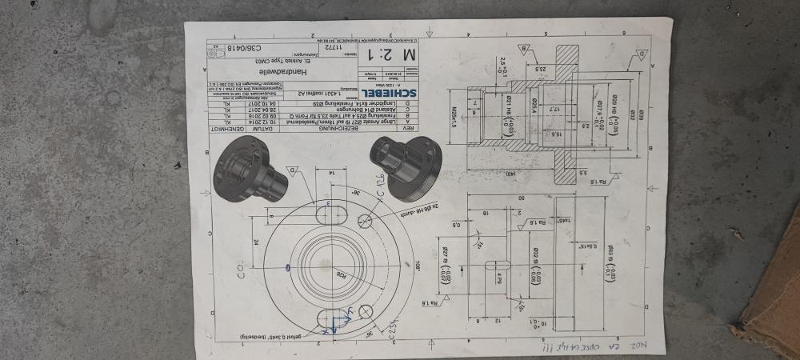
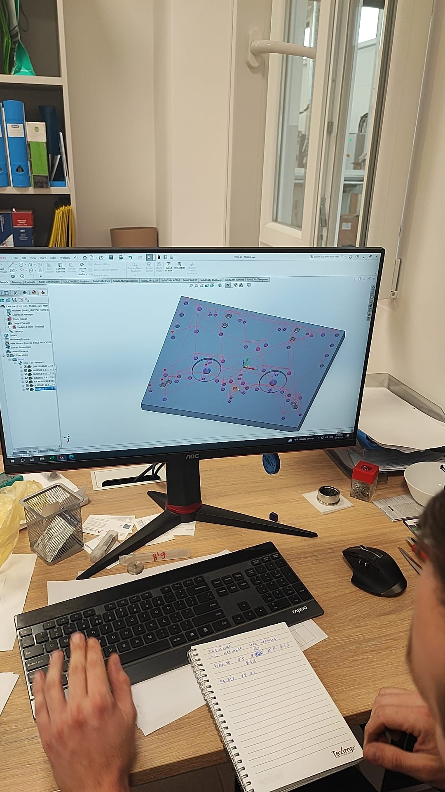
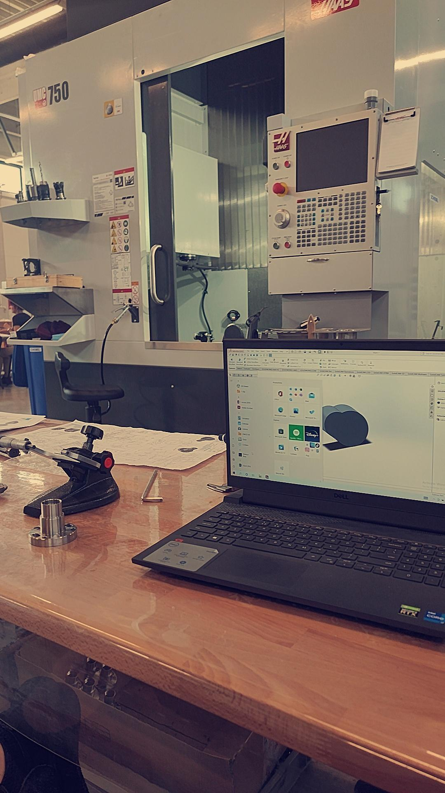
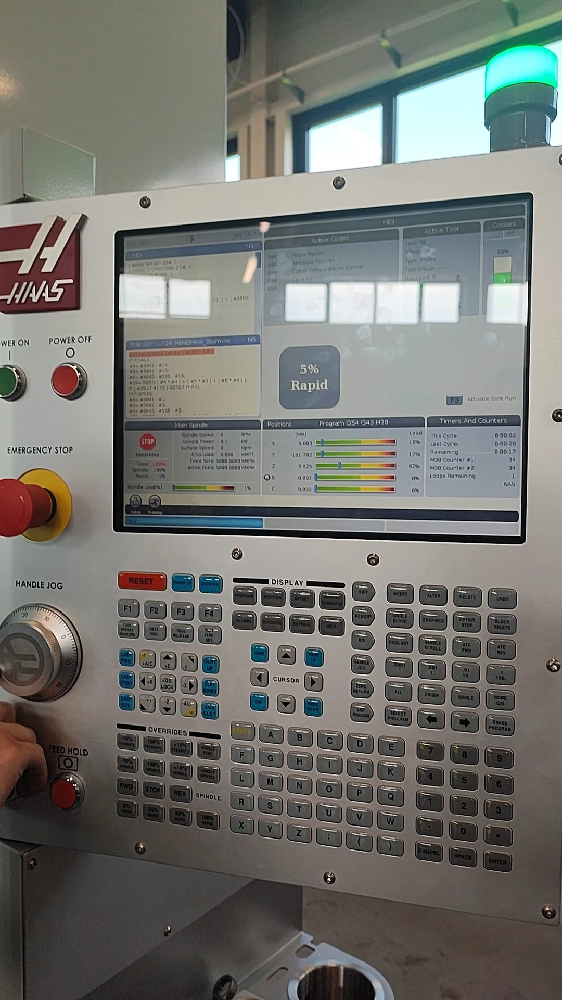
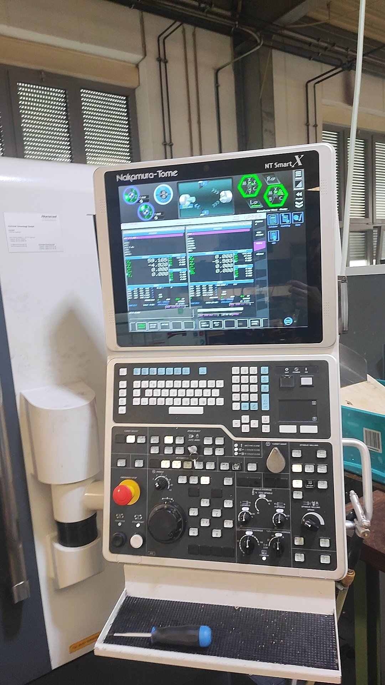
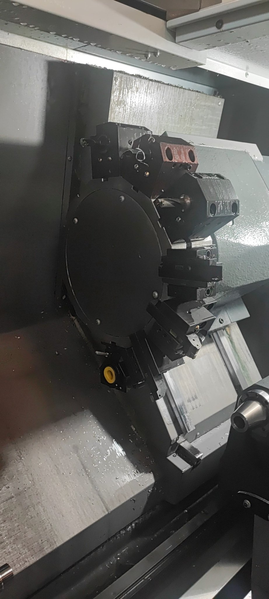
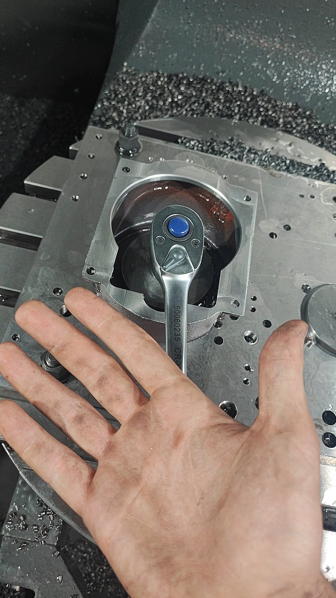
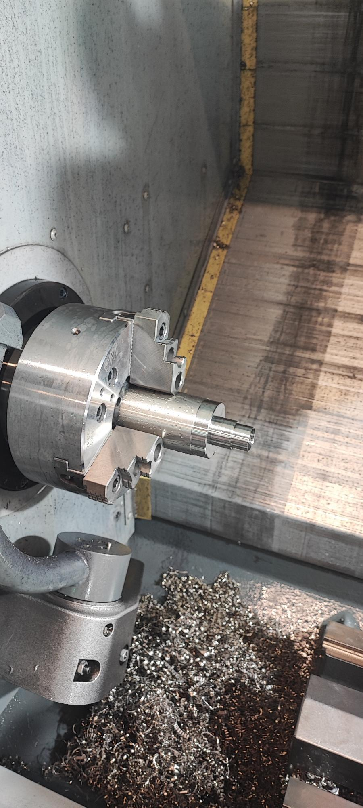
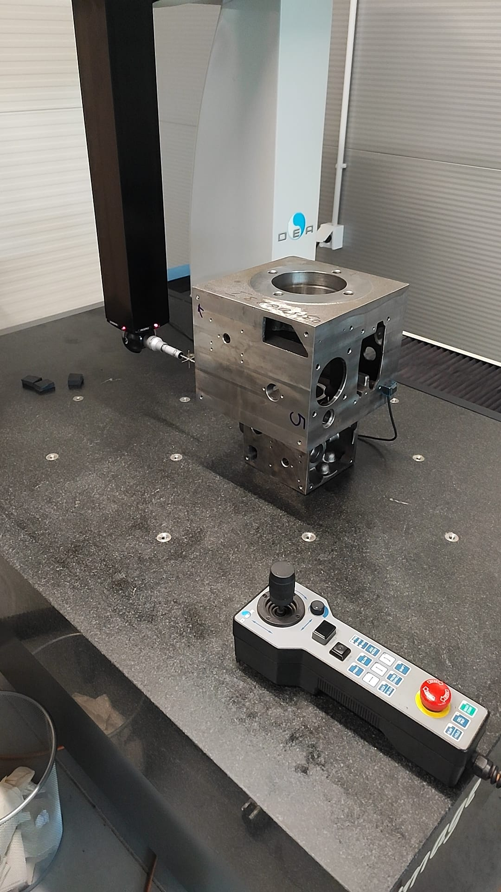
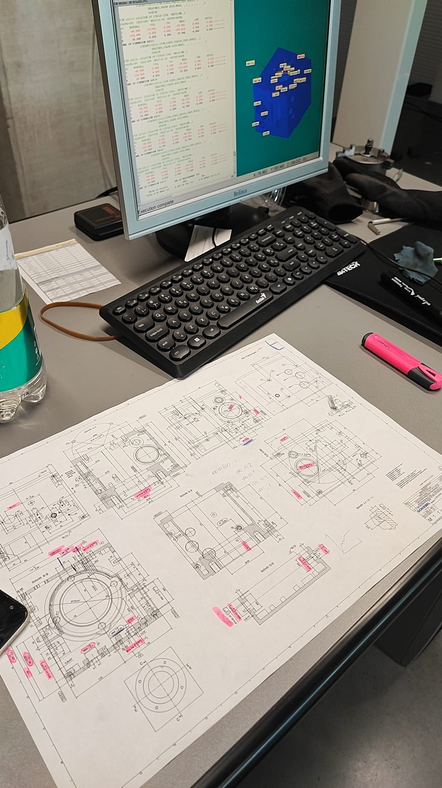

# Internship Technical Portfolio: Schiebel Components d.o.o. 🛠️

This repository serves as a technical supplement to my application for the **Mechatronics (B.Eng.)** program at THWS. It documents my 5-month internship (08/2023 - 12/2023), demonstrating a complete engineering workflow from initial design to final quality assurance.

---

## 📐 1. Engineering Design: From Blueprint to 3D Model
This section highlights the transition from an industrial paper drawing to a functional CAD component.

### Technical Blueprint Analysis

* **Description:** Interpreting official Schiebel engineering drawings for the *Handradwelle* (Handwheel Shaft). Focus on complex GD&T tolerances and material specs (1.4301 stainless steel).

### Digital CAD Reconstruction (SolidWorks)

* **Description:** High-precision 3D model recreated in SolidWorks.
* 📂 **Source CAD File:** [Download Handradwelle.sldprt](./3D%20part%2011772%20.SLDPRT

---

## 💻 2. CAD/CAM Design Phase

### Workstation Setup & Modeling

* **Description:** Professional CAD modeling environment. Preparing geometry for multi-axis CNC machining.

### Digital Workflow & SolidCAM Simulation

* **Description:** Managing manufacturing workflows and integrating digital blueprints with machine toolpath generation.

---

## ⚙️ 3. CNC Machine Programming & Control

### Haas UMC-750 Controller Interface

* **Description:** Real-time monitoring of G-code on a Haas 4-axis machine. Managing tool offsets, spindle loads, and coolant flow.

### Nakamura-Tome SmartX Interface

* **Description:** Operating high-end Nakamura-Tome multi-tasking turning centers via the digital control panel.

---

## 🛠️ 4. Machining & Production Process

### Multi-Tool Turret Setup

* **Description:** CNC turret configuration for automated multi-stage machining operations.

### Part Setup & Precision Fixing

* **Description:** Manual adjustment and securing of the workpiece within the machine to ensure perfect alignment.

### Turning Operations in Progress

* **Description:** High-precision turning of a cylindrical component. Focus on surface finish quality and dimensional stability.

---

## 📏 5. Quality Control & Metrology (CMM)

### CMM Measurement (DEA)

* **Description:** Using a DEA Coordinate Measuring Machine (CMM) to verify the final physical dimensions against the original digital model.

### Metrology Software Verification

* **Description:** Analyzing micron-level tolerances on-screen. Ensuring every feature meets the strict industrial requirements of the client.

---

## Professional Conclusion
This portfolio provides visual and technical evidence of my ability to operate within a high-standard industrial environment, handling projects from initial 3D design to final quality verification.
